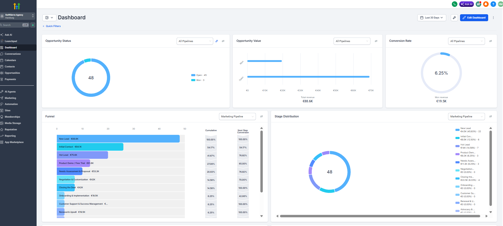
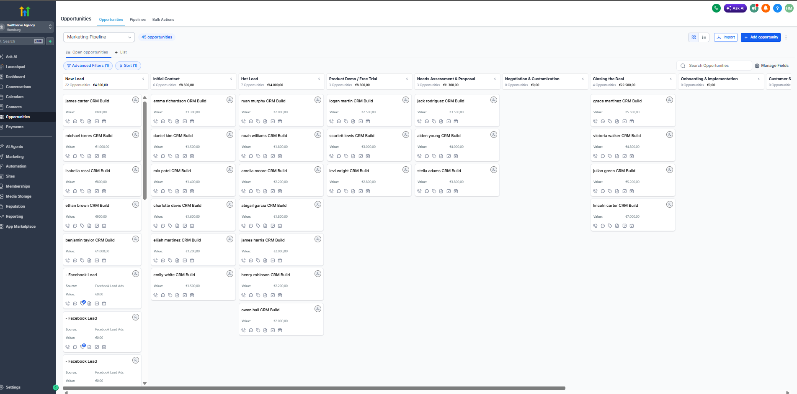
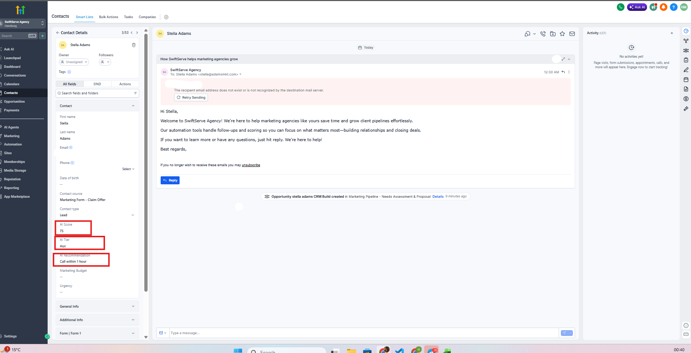
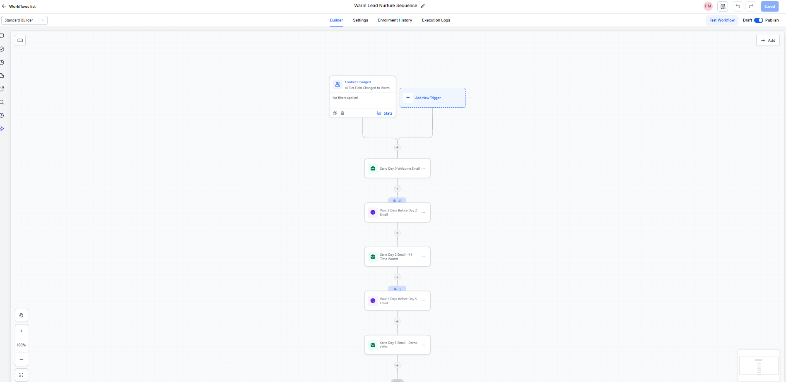
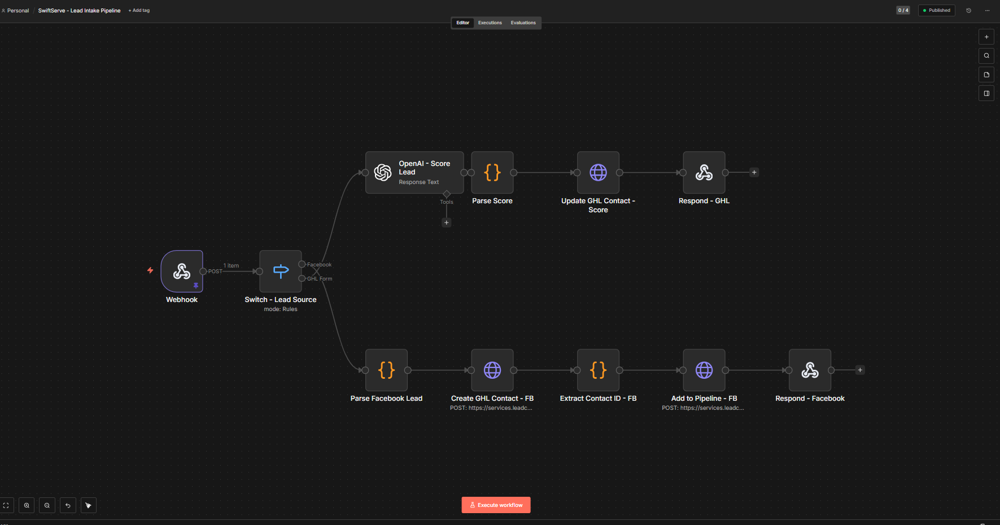

# SwiftServe Agency CRM — GoHighLevel + n8n + OpenAI

**Status: COMPLETE**
**Live Funnel:** https://swiftserve.zainsverse.de
**Niche:** Marketing Agency | Speed-to-Lead | AI Lead Scoring | Database Reactivation

---

## What This System Does

A production-grade marketing agency CRM built on GoHighLevel, n8n, and OpenAI. Every new lead — whether from a GHL funnel form or a Facebook Lead Ad — is automatically scored 0-100 by GPT-4o-mini, classified as Hot/Warm/Cold, and entered into the correct follow-up sequence. Zero manual work from lead capture to booked call.

**Full lead journey:**
1. Lead submits form at swiftserve.zainsverse.de or clicks a Facebook Lead Ad
2. n8n webhook receives the lead and routes by source (Switch node)
3. GHL Form leads: OpenAI scores 0-100 based on budget + urgency + contact quality
4. Facebook leads: contact created in GHL, tagged, added to pipeline
5. Score + tier + recommendation written back to GHL contact custom fields
6. Hot lead (70+): SMS follow-up fires within 90 seconds + WhatsApp notification
7. Warm lead (40-69): 5-day email nurture sequence starts automatically
8. Cold lead (0-39): tagged for long-term nurture
9. Dormant leads: reactivated every 2 weeks via 3-touch SMS + email sequence
10. New clients: automated 14-day onboarding sequence fires on deal close

---

## Screenshots

### GHL Dashboard — €88.6K Pipeline, 48 Opportunities, 6.25% Conversion


### Pipeline Kanban Board — All Stages Populated with Deal Values


### Contact Record — AI Score, Tier and Recommendation Auto-Populated


### GHL Automations — 3 Published Workflows


### n8n — Merged Lead Intake Pipeline (GHL Form + Facebook Lead Ads)


---

## Stack

| Layer | Tool |
|---|---|
| CRM | GoHighLevel (Marketing Agency sub-account) |
| Automation | n8n (self-hosted, Hetzner VPS via Coolify) |
| AI Scoring | OpenAI API (GPT-4o-mini) |
| Lead Capture | GHL Funnel Builder + Facebook Lead Ads webhook |
| Messaging | GHL native SMS + email + WhatsApp Business API |
| Calendar | GHL native calendar |
| Domain | swiftserve.zainsverse.de |

---

## GHL Setup

- **Sub-account:** SwiftServe Agency (Marketing Agency snapshot)
- **Location ID:** CVwKtPqeecFe8Xwh6gHF
- **Pipeline:** Marketing Pipeline (12 stages)
- **Custom fields:** AI Score, AI Tier, AI Recommendation, Marketing Budget, Urgency
- **Funnel:** CRM Software Offer — 3 steps (Offer, Appointment, Thank You)
- **Domain:** swiftserve.zainsverse.de (CNAME on Porkbun)

## GHL Workflows (all Published)

1. **Contact AI Scoring** — New Contact Created fires webhook to n8n
2. **Hot Lead - 90 Second SMS** — AI Tier = Hot fires personalized SMS
3. **Warm Lead Nurture Sequence** — AI Tier = Warm fires 5-day email drip

## GHL Config Docs

- [Database Reactivation Workflow](ghl-config/reactivation-workflow.md) — 3-touch SMS + email over 7 days for 60-day dormant leads
- [Client Onboarding Automation](ghl-config/client-onboarding-workflow.md) — 14-day automated onboarding on deal close
- [Snapshot Guide](ghl-config/snapshot-guide.md) — export and import the full SwiftServe system
- [Sub-account Setup](ghl-config/sub-account-setup.md) — onboard a new agency client in under 1 hour
- [Custom Fields](ghl-config/custom-fields.md)
- [Email Sequences](ghl-config/email-sequences.md)
- [SMS Messages](ghl-config/sms-messages.md)

---

## n8n Workflows

### SwiftServe Lead Intake Pipeline (live)
Single webhook handles both lead sources via Switch node:

```
Webhook
    |
Switch - Lead Source
    |-- Facebook Lead Ads --> Parse Lead --> Create GHL Contact --> Add to Pipeline --> Respond
    |-- GHL Form -----------> OpenAI Score --> Parse Score --> Update GHL Contact --> Respond
```

**Webhook URL:** `https://n8n.zainsverse.de/webhook/52cafb1c-4da4-4d03-bada-e78c1c39ce14`

### Hot Lead WhatsApp Notify (live)
GHL fires webhook when AI Tier = Hot. n8n sends WhatsApp alert to your number via Meta Cloud API.

### Meta Webhook Verification (live)
Handles Facebook GET verification requests for Lead Ads webhook setup.

### Importable workflow files:
- [ai-scoring-workflow.json](n8n-workflow/ai-scoring-workflow.json) — live AI scoring workflow
- [facebook-leads-to-ghl.json](n8n-workflow/facebook-leads-to-ghl.json) — Facebook Lead Ads integration
- [whatsapp-hot-lead.json](n8n-workflow/whatsapp-hot-lead.json) — WhatsApp hot lead notification

---

## Results

| Metric | Value |
|---|---|
| Total pipeline value | €88,600 |
| Won revenue | €19,500 |
| Conversion rate | 6.25% |
| Total opportunities | 48 |
| Lead sources connected | 2 (GHL Form + Facebook Lead Ads) |
| AI scoring | GPT-4o-mini, 0-100 score |
| Speed to lead | Under 90 seconds |
| WhatsApp alerts | Live via Meta Cloud API |

---

## Screening Questions This Unlocks

- "Describe a custom GHL automation you built and the result it drove" YES
- "Have you built speed-to-lead systems before?" YES
- "Experience with database reactivation in GHL?" YES
- "Can you integrate Facebook Lead Ads with GHL?" YES
- "Have you used OpenAI API inside a GHL workflow?" YES
- "Experience with WhatsApp Business API?" YES
- "Can you build client onboarding automation in GHL?" YES

---

## Upwork Portfolio Card

```
SwiftServe Agency — Marketing Agency CRM
AI-scored leads from 2 sources, speed-to-lead SMS in 90 seconds,
Facebook Lead Ads connected, WhatsApp alerts, full onboarding automation.
[Live Funnel: swiftserve.zainsverse.de] [GitHub]
Stack: GoHighLevel, n8n, OpenAI API, WhatsApp Business API
Result: €88.6K pipeline. Every lead scored and followed up automatically.
```